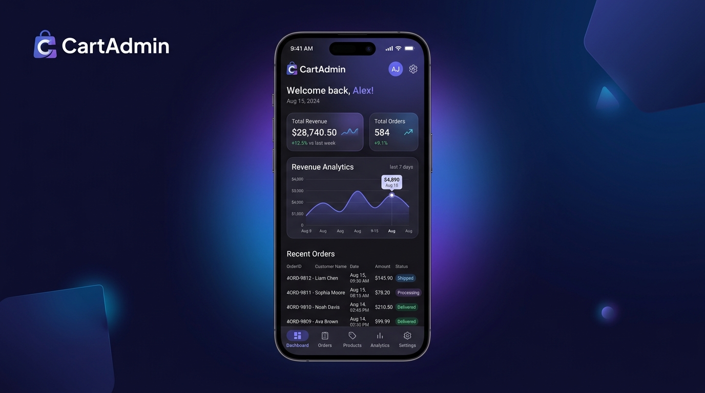
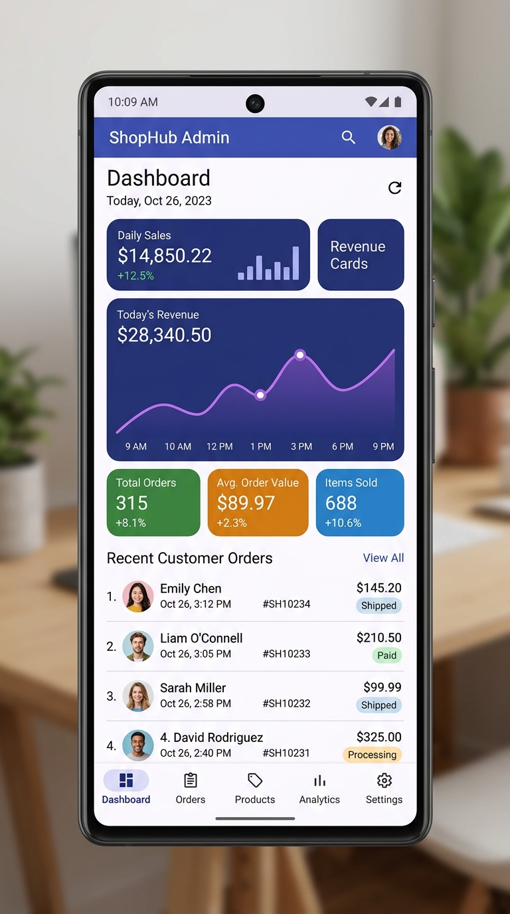
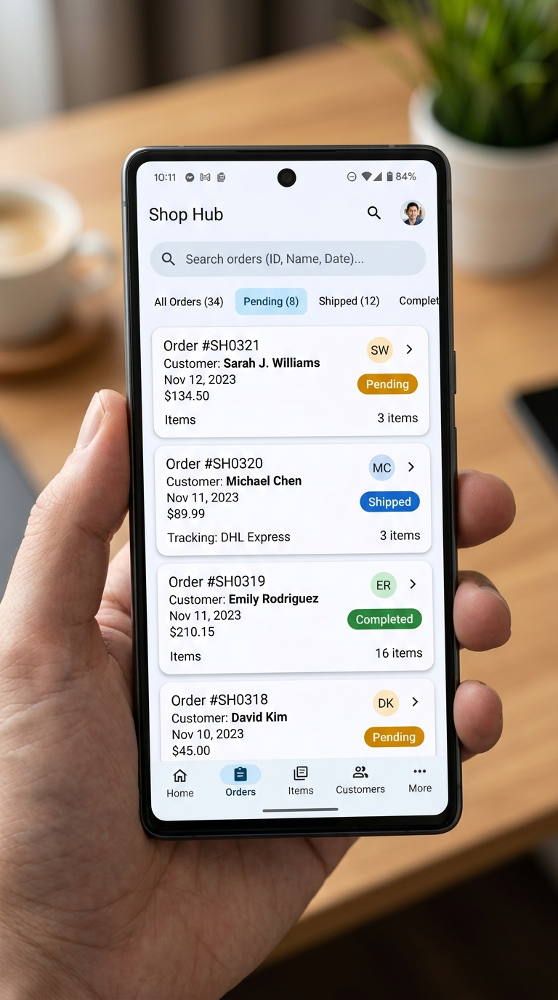

# 🛒 CartAdmin — E-Commerce Store Admin & Analytics for Android

<p align="center">
  <a href="https://github.com"></a>
  <a href="https://kotlinlang.org"></a>
  <a href="https://developer.android.com/jetpack/compose"></a>
  <a href="https://developer.android.com/training/data-storage/room"></a>
  <a href="https://github.com"></a>
  <a href="https://github.com"></a>
</p>

<p align="center">
  
</p>

---

## 📱 About CartAdmin

**CartAdmin** is a modern, high-performance Android companion application engineered for e-commerce store owners and administrators. Built entirely with **Jetpack Compose** and **Material Design 3**, CartAdmin delivers real-time sales metrics, revenue analytics, and comprehensive store management directly to your mobile device.

Whether running OpenCart or custom commerce endpoints, CartAdmin provides continuous store visibility, offline-first reliability, and push notification support.

---

## ✨ Key Features

- 📊 **Real-Time Sales & Revenue Analytics**: Monitor today's revenue, order counts, customer registrations, and period-over-period growth with charts and KPI cards.
- 📦 **Order Lifecycle Management**: View, filter, and update customer orders, process statuses (Pending, Processing, Shipped, Completed, Cancelled), and review line items.
- 👥 **Customer Directory**: Access customer history, contact details, total orders placed, and lifetime value metrics.
- 🏷️ **Product & Category Catalog**: Real-time product inventory control, stock management, price updates, and category organization.
- 📶 **Offline-First Resilience**: Powered by Room database caching for continuous access to your store metrics and catalogs even without internet connectivity.
- 🔔 **Instant Push Notifications**: Firebase Cloud Messaging (FCM) integration with custom channels for immediate alerts on new orders and status changes.
- 🎨 **Adaptive Material You UI**: Dynamic theming, high-contrast typography, responsive layout scaling across phones and foldables, and smooth navigation.

---

## 📸 Screenshots

<p align="center">
  
  &nbsp;&nbsp;&nbsp;&nbsp;
  
</p>

---

## 🛠️ Tech Stack & Architecture

- **UI Framework**: Jetpack Compose with Material 3 components & theme tokens
- **Architecture**: Clean MVVM (Model-View-ViewModel) with Kotlin Coroutines & StateFlow
- **Local Persistence**: Android Room Database (Entities, DAOs, Type Converters)
- **Networking**: Retrofit 2 + OkHttp3 + Kotlinx Serialization
- **Cloud Messaging**: Firebase Cloud Messaging (FCM) for real-time notifications
- **Target SDK**: Android 14+ (minSdk 26, targetSdk 35)

---

## 📥 How to Download & Install the APK

### 1. Download via AI Studio / GitHub Releases
- Download the generated `CartAdmin-release.apk` (or `CartAdmin-debug.apk`) from the **Releases** section of your GitHub repository.
- Alternatively, in Google AI Studio, use the top menu: **Export / Download APK / AAB**.

### 2. Sideload on Android
1. Transfer or download the `.apk` file directly on your Android phone.
2. Open the file via your device's File Manager or Downloads app.
3. If prompted, enable **"Install unknown apps"** for your browser / file manager.
4. Tap **Install** and open **CartAdmin** to connect your store!

---

## 🚀 Building from Source

To compile and build the APK locally using Gradle:

```bash
# Clone repository
git clone https://github.com/your-username/cartadmin-android.git
cd cartadmin-android

# Build Debug APK
./gradlew assembleDebug

# Build Release APK
./gradlew assembleRelease
```
The compiled APK will be located at:
`app/build/outputs/apk/debug/app-debug.apk`

---

## 📄 License
CartAdmin is distributed under the MIT License.
