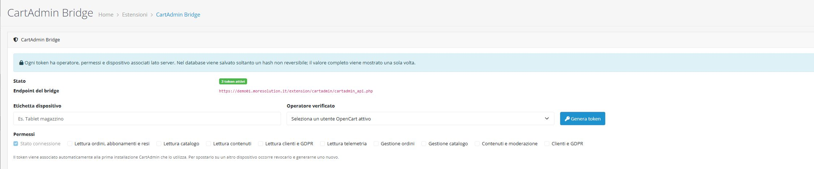

# CartAdmin 2.1.5

CartAdmin è un'app Android per consultare e amministrare un negozio OpenCart da smartphone. L'app è sviluppata in Kotlin con Jetpack Compose e comunica esclusivamente con il modulo **CartAdmin Bridge** incluso nella stessa release.

> App e bridge devono avere la stessa versione. Per la v2.1.5 aggiorna sia l'APK sia `cartadmin.ocmod.zip`.

## Download

La versione stabile corrente è [CartAdmin v2.1.5](https://github.com/domtric80/OpenCart-mobile-App/releases/latest).

| Componente | File | Compatibilità confermata |
| --- | --- | --- |
| App Android | `CartAdmin-v2.1.5.apk` | Android 7.0 o successivo, API 24–36 |
| Bridge OpenCart | `cartadmin.ocmod.zip` | OpenCart 4.1.x |
| Integrità | `SHA256SUMS.txt` | SHA-256 di APK e modulo |

Il bridge non dichiara compatibilità con OpenCart 3.x.

## Cosa puoi fare

- controllare dashboard, ordini, resi e abbonamenti;
- aggiornare lo stato degli ordini;
- gestire prodotti, categorie, quantità, prezzi e immagini;
- creare immagini prodotto dalla fotocamera o sceglierle dalla galleria;
- gestire pagine, recensioni, articoli e categorie CMS;
- creare articoli con immagine, autore, contenuto e meta tag;
- consultare clienti e inoltrare richieste sensibili di approvazione o GDPR;
- visualizzare i visitatori online distinguendo guest e clienti registrati;
- consultare l'audit server-side delle operazioni;
- usare più profili negozio sullo stesso dispositivo.

La barra inferiore contiene cinque aree: **Home**, **Vendite**, **Catalogo**, **Clienti** e **Altro**. I sottomenu mantengono accessibili le funzioni senza affollare la navigazione.

<p align="center">
  
  &nbsp;&nbsp;
  
</p>

## Installazione e prima configurazione

Servono:

- un negozio OpenCart 4.1.x raggiungibile tramite HTTPS;
- un account amministrativo autorizzato a installare estensioni;
- un dispositivo Android 7.0 o successivo;
- APK e bridge scaricati dalla medesima release.

### 1. Scarica i file

Apri [GitHub Releases](https://github.com/domtric80/OpenCart-mobile-App/releases/latest) e scarica:

1. `CartAdmin-v2.1.5.apk`;
2. `cartadmin.ocmod.zip`;
3. facoltativamente `SHA256SUMS.txt`, per verificare l'integrità dei file.

Non estrarre e non rinominare `cartadmin.ocmod.zip`.

### 2. Installa CartAdmin Bridge in OpenCart

1. Accedi al pannello amministrativo OpenCart.
2. Apri **Estensioni > Programma di installazione**; in inglese: **Extensions > Installer**.
3. Premi il pulsante di caricamento e seleziona `cartadmin.ocmod.zip`.
4. Attendi il completamento dell'installazione.
5. Apri **Estensioni > Estensioni**.
6. Seleziona **Moduli** come tipo di estensione.
7. Cerca **CartAdmin Bridge**, premi **Installa** e poi **Modifica**.

Lo ZIP ufficiale contiene `install.json`. Se OpenCart segnala che il file manca, è stato caricato un archivio errato oppure lo ZIP è stato estratto e ricomposto.

Non copiare manualmente file PHP sul server e non configurare la chiave modificando i file del bridge.

### 3. Genera un token per il dispositivo

Nel modulo **CartAdmin Bridge**:

1. inserisci un'etichetta riconoscibile, per esempio `Telefono magazzino`;
2. seleziona un utente OpenCart attivo nel campo **Operatore verificato**;
3. abilita soltanto i permessi necessari;
4. premi **Genera token**;
5. premi **Copia token** e verifica il messaggio di conferma;
6. se il browser impedisce la copia automatica, seleziona il valore e usa `Ctrl+C`;
7. conserva il token solo per il tempo necessario a inserirlo nell'app.

<p align="center">
  
</p>

Il token completo inizia con `ca_` ed è mostrato una sola volta. OpenCart conserva soltanto un hash non reversibile.

#### Come scegliere i permessi

| Permesso nel pannello | Consente all'app di |
| --- | --- |
| Stato connessione | verificare bridge e autenticazione; è sempre richiesto |
| Lettura ordini, abbonamenti e resi | mostrare Vendite, abbonamenti e resi |
| Lettura catalogo | mostrare prodotti, categorie e piani |
| Lettura contenuti | mostrare pagine, recensioni e CMS |
| Lettura clienti e GDPR | mostrare clienti e richieste correlate |
| Lettura telemetria | mostrare Traffic e visitatori online |
| Gestione ordini | modificare gli ordini |
| Gestione catalogo | creare e modificare prodotti e categorie |
| Contenuti e moderazione | creare e modificare contenuti e recensioni |
| Clienti e GDPR | inviare operazioni sensibili alla coda di approvazione |

I permessi di gestione non sostituiscono quelli di lettura. Per vedere e modificare il Catalogo, per esempio, seleziona sia **Lettura catalogo** sia **Gestione catalogo**. Un token con soli permessi di gestione può superare il Test API ma ricevere `403` aprendo gli elenchi.

Ogni token appartiene a un singolo operatore e viene associato al primo dispositivo che lo usa. Per un altro telefono crea un token separato. La revoca di un token non interrompe gli altri dispositivi.

### 4. Installa e proteggi l'app

1. Apri `CartAdmin-v2.1.5.apk` sul telefono.
2. Se Android lo richiede, autorizza temporaneamente l'installazione da quella specifica origine.
3. Al primo avvio inserisci un nome operatore locale e una password robusta.
4. Se disponibile, abilita lo sblocco biometrico forte.

<p align="center">
  
</p>

La password locale protegge l'accesso all'app. L'identità usata nell'audit proviene invece dall'utente OpenCart assegnato al token nel pannello.

### 5. Aggiungi il primo negozio

1. Apri **Altro > Configurazione**.
2. Inserisci un nome riconoscibile, per esempio `Negozio principale`.
3. Inserisci l'URL base HTTPS, per esempio `https://negozio.example`.
4. Non aggiungere `/admin`, `/extension/cartadmin/` o `cartadmin_api.php`.
5. Inserisci un'etichetta locale nel campo operatore.
6. Incolla il token `ca_...` appena generato.
7. Seleziona **OpenCart 4.1.x**.
8. Premi **Aggiungi**: questo pulsante crea e salva il primo profilo.

<p align="center">
  
</p>

Se non esistono profili, il pulsante **Salva** non sostituisce **Aggiungi**. Dopo il salvataggio il campo token torna vuoto e il valore non viene mai più mostrato. Per modificare nome o URL lascia vuoto il campo token: quello protetto rimane memorizzato.

### 6. Verifica e sincronizza

1. Premi **Test API**.
2. Controlla che venga riconosciuto **CartAdmin Bridge**.
3. Premi **Sincronizza dati adesso**.
4. Apri **Catalogo**, **Vendite** e gli altri menu concessi al token.
5. Nel pannello OpenCart verifica che il token passi da **In attesa del primo uso** ad **Associato**.

## Risoluzione dei problemi

| Messaggio | Causa più probabile | Soluzione |
| --- | --- | --- |
| `401 Non autorizzato` | token vuoto, incompleto, revocato o appartenente a un altro dispositivo | genera un nuovo token, copialo integralmente e salvalo sul dispositivo corretto |
| Test API riuscito ma menu in `403` | manca lo scope di lettura richiesto | genera un token con il corrispondente permesso **Lettura**; aggiungi anche **Gestione** se devi modificare |
| Il nuovo token non autentica | negli appunti è rimasto il token precedente | usa **Copia token** della v2.1.5 e controlla la conferma, oppure seleziona manualmente e usa `Ctrl+C` |
| Modulo non rilevato | bridge assente, non installato o di versione differente | aggiorna `cartadmin.ocmod.zip`, installa il modulo e usa la stessa versione dell'app |
| Impossibile salvare il profilo | URL non HTTPS, campi obbligatori mancanti o Keystore non hardware-backed | correggi i campi; usa un dispositivo con TEE o StrongBox |
| Traffic vuoto | tracciamento OpenCart disabilitato o nessun visitatore attivo | abilita **Clienti online** nelle impostazioni OpenCart e visita lo store |

### Telemetria visitatori

In OpenCart apri **Sistema > Impostazioni**, modifica il negozio e nella scheda **Opzioni** abilita **Clienti online**. CartAdmin legge la tabella nativa `customer_online` e distingue:

- guest: `customer_id = 0`;
- clienti registrati: `customer_id > 0`.

L'app non riceve IP, nome, email o identificativo cliente. Metriche che OpenCart non registra, come geolocalizzazione o bounce rate, rimangono non disponibili invece di essere simulate.

### Foto prodotto e contenuti CMS

- In **Catalogo > Prodotti > Nuovo prodotto** scegli **Fotocamera** o **Galleria**.
- Android condivide con CartAdmin soltanto il file scelto o una foto temporanea privata; non è richiesto l'accesso generale alla galleria.
- Il bridge accetta JPEG, PNG e WebP fino a 5 MB, verifica il contenuto e salva il file con un nome casuale.
- In **Altro > CMS > Argomenti** puoi creare una categoria CMS.
- In **Altro > CMS > Articoli** puoi creare un articolo con titolo, autore, contenuto, meta titolo obbligatorio, meta descrizione, parole chiave, immagine e stato.
- L'editor HTML usa una pagina intera e una toolbar con paragrafo, H1/H2/H3, colore, grassetto, corsivo, sottolineato ed elenco puntato.

## Sicurezza

- il token OpenCart è casuale a 256 bit e nel database viene conservato soltanto come hash;
- Android cifra il profilo negozio con AES-256-GCM;
- la chiave AES non è esportabile ed è accettata soltanto se custodita in TEE o StrongBox;
- lo sblocco biometrico firma una challenge con una chiave ECDSA hardware-backed e autenticata per singolo utilizzo;
- ogni richiesta al bridge è firmata; timestamp e nonce impediscono il riutilizzo;
- il token viene trasmesso soltanto negli header HTTPS e non compare in URL o form body;
- dati remoti, ordini, clienti, catalogo e telemetria restano soltanto nella sessione sbloccata;
- quando l'app passa in background la sessione amministrativa e il relativo ViewModel vengono distrutti;
- screenshot, registrazione dello schermo, overlay e tocchi oscurati sono bloccati nella build stabile;
- le notifiche non mostrano dati cliente, importi, prodotti o token;
- le scritture e il relativo audit server-side sono confermati atomicamente;
- le operazioni sensibili su clienti e GDPR richiedono conferma nel pannello OpenCart.

Non inserire token, password, keystore o chiavi di firma in screenshot, issue, chat, commit o file versionati.

## Novità della v2.1.5

- tornando nell'app dopo uno scatto, la scheda del nuovo prodotto e i dati già inseriti rimangono aperti;
- l'uscita temporanea verso la fotocamera sospende una sola volta il blocco in background, per un massimo di cinque minuti;
- annullamento, errore o completamento della fotocamera chiudono sempre l'eccezione temporanea;
- galleria, blocco biometrico ordinario e timeout di sicurezza restano invariati;
- il pulsante **Copia token** attende e verifica l'esito della Clipboard API;
- se il browser limita gli appunti, il pannello seleziona il campo e propone `Ctrl+C`;
- un messaggio distingue chiaramente copia riuscita e copia manuale necessaria;
- il valore completo continua a essere mostrato una sola volta e non viene registrato nei log.

Per la cronologia completa consulta [Releases](https://github.com/domtric80/OpenCart-mobile-App/releases).

## Architettura

- UI: Jetpack Compose e Material 3;
- stato: MVVM, `MainViewModel`, Coroutines e `StateFlow`;
- persistenza locale: Room, limitata ai profili negozio cifrati;
- rete: Retrofit, OkHttp e Moshi;
- sicurezza locale: Android Keystore, AES-256-GCM, PBKDF2 e BiometricPrompt;
- integrazione server: estensione PHP CartAdmin Bridge per OpenCart 4.1.x.

## Build e test locali

Il progetto usa il Gradle Wrapper, Android SDK 36 e preferibilmente il JDK integrato in Android Studio.

In PowerShell:

```powershell
$env:JAVA_HOME = 'C:\Program Files\Android\Android Studio\jbr'
$env:ANDROID_HOME = "$env:LOCALAPPDATA\Android\Sdk"
./gradlew.bat :app:testDebugUnitTest :app:compileDebugAndroidTestKotlin :app:lintDebug :app:assembleDebug
```

Con un emulatore o dispositivo collegato:

```powershell
& "$env:ANDROID_HOME\platform-tools\adb.exe" devices
./gradlew.bat :app:connectedDebugAndroidTest
```

GitHub Actions esegue build, test unitari, compilazione dei test strumentali, Android Lint, controlli PHP/OCMOD, CodeQL, Semgrep, controllo dei segreti, firma e attestazione degli artefatti.

## Verifica dei checksum

Nella cartella che contiene i file scaricati:

```powershell
Get-FileHash -Algorithm SHA256 .\CartAdmin-v2.1.5.apk
Get-FileHash -Algorithm SHA256 .\cartadmin.ocmod.zip
Get-Content .\SHA256SUMS.txt
```

I valori calcolati devono coincidere con quelli pubblicati in `SHA256SUMS.txt`.

## Repository

- `app/`: applicazione Android e test;
- `opencart-plugin/`: manifest, modulo amministrativo, bridge PHP e test;
- `docs/screenshots/`: schermate usate nella documentazione;
- `.github/workflows/`: build, pubblicazione e sicurezza;
- `gradle/` e `gradlew*`: Gradle Wrapper.

## Licenza e progetto

CartAdmin è distribuito con licenza [GNU GPL v3](LICENSE).

- [OpenCart ITALIA](https://www.opencartitalia.it)
- [SOLO SOLUZIONI](https://www.solosoluzioni.it)
- [Domenico Tricarico](https://www.domenicotricarico.it)
