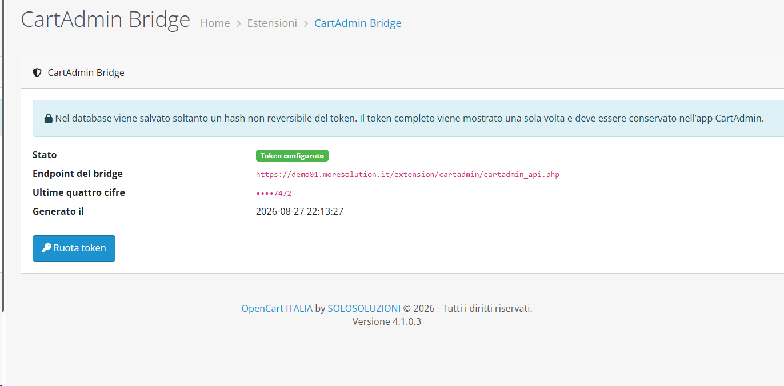
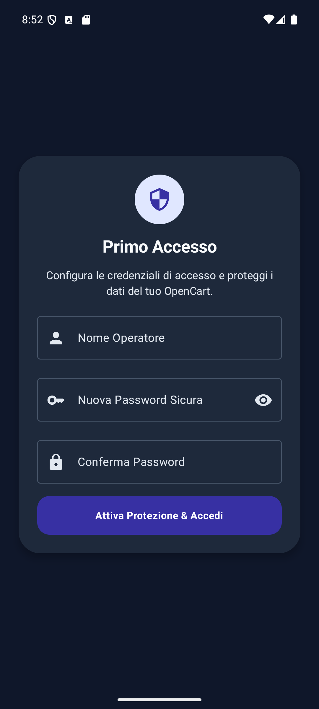
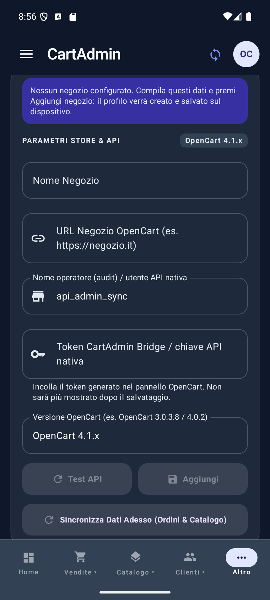
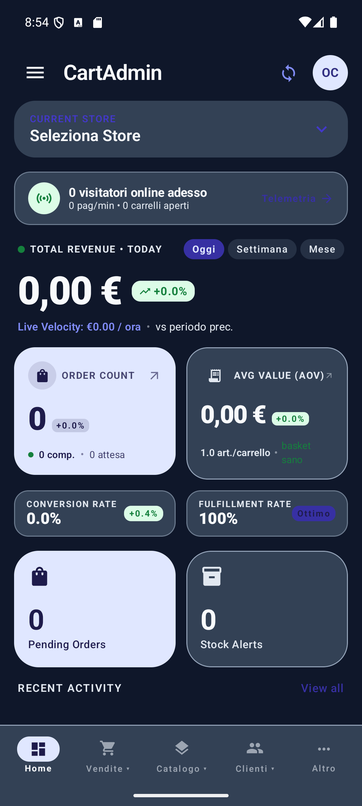
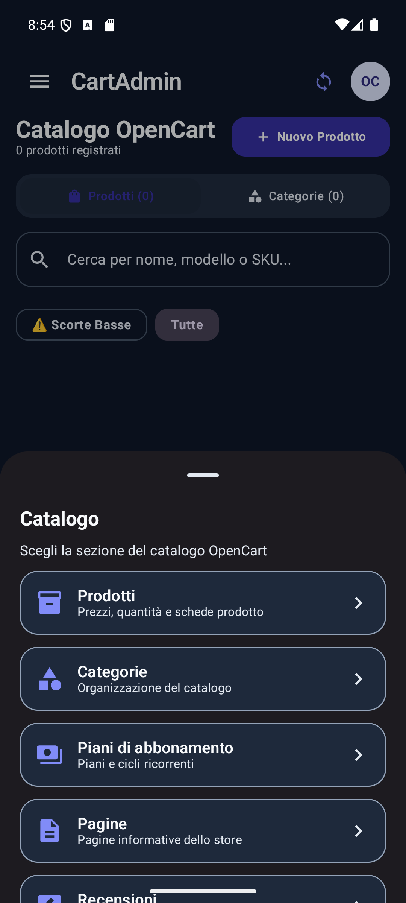

# CartAdmin 2.0.1

CartAdmin è un'app Android per consultare e amministrare un negozio OpenCart da smartphone. Il progetto è sviluppato in Kotlin con Jetpack Compose e include il bridge CartAdmin per OpenCart 4.1.x. La release stabile corrente è la v2.0.1.

## Download

La release stabile è disponibile in [GitHub Releases](https://github.com/domtric80/OpenCart-mobile-App/releases/latest).

| Componente | File | Compatibilità confermata |
| --- | --- | --- |
| App Android | `CartAdmin-v2.0.1.apk` | Android 7.0 o successivo, API 24–36 |
| Bridge OpenCart | `cartadmin.ocmod.zip` | OpenCart 4.1.x |

Il bridge incluso non dichiara compatibilità con OpenCart 3.x. Un eventuale pacchetto per quel ramo dovrà essere pubblicato e verificato separatamente.

### Novità della 2.0.1

- migliorato il contrasto dell'avviso di prima configurazione e del badge della versione OpenCart;
- nuova icona launcher ufficiale OpenCart Italia, adattiva, tonda e monocromatica;
- eliminato l'ultimo valore dimostrativo degli avvisi scorte: senza negozio la dashboard mostra valori zero;
- aggiunta una guida illustrata completa per installare il bridge, generare o ruotare il token e configurare il primo negozio;
- mantenute le funzionalità e la navigazione amministrativa introdotte nella 2.0.0.

App Android e bridge devono essere aggiornati entrambi alla v2.0.1.

### Novità della 2.0.0

- barra inferiore ridotta a cinque voci: Home, Vendite, Catalogo, Clienti e Altro;
- sottomenu Catalogo con Prodotti, Categorie, Piani di abbonamento, Pagine e Recensioni;
- nuovo menu CMS con Articoli, Argomenti, Commenti e Antispam;
- nuovo menu Clienti con Clienti, Approvazione clienti e GDPR;
- Traffic, CMS e Configurazione raggruppati sotto Altro;
- Audit e Licenza spostati nella schermata Configurazione;
- elenchi amministrativi letti in tempo reale dalle tabelle native OpenCart, senza record dimostrativi;
- attivazione e disattivazione remota verificata per i moduli che espongono uno stato semplice;
- compatibilità esplicita: se una tabella non esiste nella versione installata, l'app mostra “funzione non disponibile” invece di dati fittizi.

Nel ramo di sviluppo 2.1, approvazioni clienti e richieste GDPR possono essere inviate dall'app a una coda protetta. Un amministratore deve confermarle nel pannello CartAdmin Bridge prima che vengano eseguite dai modelli nativi OpenCart con i relativi eventi ed email.

### Sviluppo 2.1 (non ancora release stabile)

- CRUD remoto verificato per prodotti e categorie;
- approvazioni clienti e richieste GDPR tramite coda amministrativa deduplicata;
- modifica controllata di titolo/ordinamento delle pagine, titolo/autore degli articoli e titolo/ordinamento degli argomenti;
- modifica di autore, testo e valutazione delle recensioni con ricalcolo della media prodotto;
- contenuti HTML, SEO e traduzioni secondarie deliberatamente preservati e non sovrascritti dall'editor mobile.
- token distinti e revocabili, ciascuno associato a operatore, dispositivo e permessi minimi;
- audit server-side delle modifiche editoriali con identità verificata e digest HMAC, senza copiare i contenuti nel registro.
- acquisizione dell'immagine di un prodotto dalla fotocamera o dalla galleria, con upload multipart autenticato, limite di 5 MB e validazione JPEG/PNG/WebP sia nell'app sia nel bridge;
- telemetria distinta tra visitatori guest e clienti registrati, senza esporre indirizzi IP o identità;
- creazione di articoli e categorie CMS direttamente dall'app, con associazione allo store, replica sulle lingue attive e audit atomico.
- creazione articoli completa dei campi nativi Meta tag Titolo, Descrizione e Parola Chiave, oltre all'immagine editoriale validata;
- acquisizione semplificata tramite i contratti di sistema `TakePicturePreview` e `GetContent`, senza file temporanei, URI condivisi, Photo Picker o permessi generali per fotocamera e archivio; gli eventuali errori OEM vengono mostrati con il relativo dettaglio tecnico;
- `FragmentActivity` allineata ad AndroidX Fragment 1.9.0 per supportare i request code del moderno `ActivityResultRegistry` ed eliminare l'errore “Can only use lower 16 bits for requestCode”;
- lettura delle sessioni che OpenCart mantiene in `customer_online`, senza un secondo filtro basato sull'orologio MySQL, mantenendo separati guest e clienti registrati;
- diagnostica del numero di sessioni e dell'ultima visita registrata, con istruzioni esplicite quando OpenCart non popola `customer_online`.
- creazione di prodotti e articoli in schermate dedicate a pagina intera, al posto delle finestre modali;
- editor visuale per descrizioni prodotto e contenuti articolo con Paragrafo/H1/H2/H3, colore testo, grassetto, corsivo, sottolineato ed elenco puntato;
- barra di formattazione adattata alla tastiera e sanificazione HTML sia nell'app sia nel bridge: script, media incorporati, link attivi, handler evento e attributi arbitrari non vengono salvati.

Queste funzioni richiedono app e bridge `2.1.0-dev.11` e non fanno ancora parte della release stabile v2.0.1.

Nel pannello 2.1, prima di generare un token occorre indicare un'etichetta, selezionare un utente amministrativo OpenCart attivo e scegliere gli scope necessari. Il token conserva `user_id` e username verificati lato server e si associa alla prima installazione Android che lo usa; per un secondo dispositivo va creato un token separato. La revoca è individuale e non interrompe gli altri dispositivi. Il nome operatore eventualmente conservato nell'app non può sostituire quello assegnato dal pannello.

Durante l'aggiornamento, il bridge migra una sola volta l'hash del token 2.0 esistente senza recuperarne il valore in chiaro. Quel token legacy mantiene temporaneamente tutti gli scope ed è marcato nel pannello come da sostituire: dopo aver installato app e bridge 2.1, creare un token nominativo con privilegi minimi, provarlo sul dispositivo e revocare quello legacy. App e bridge 2.1 devono essere aggiornati insieme perché il nuovo bridge richiede anche l'identità casuale dell'installazione Android.

Per usare i nuovi moduli, app Android e bridge OpenCart devono essere aggiornati entrambi alla v2.0.0.

### Novità della 1.2.8

- telemetria visitatori reale letta dalla tabella nativa OpenCart `customer_online`, con aggiornamento automatico ogni 30 secondi;
- diagnostica esplicita quando il tracciamento **Clienti online** è disabilitato o il bridge non è aggiornato;
- modifica remota verificata di nome, descrizione, modello, SKU, prezzo, quantità, stato e categoria esistente dei prodotti;
- aggiornamenti locali applicati soltanto dopo la conferma positiva del bridge;
- eliminati i messaggi di successo per operazioni che non hanno ancora un endpoint remoto sicuro;
- versione e build installate visibili nella schermata Config;
- mantenute le correzioni 1.2.7 per abbonamenti e resi senza dati dimostrativi.

La creazione e l'eliminazione dei prodotti e il CRUD delle categorie restano temporaneamente non disponibili dall'app: CartAdmin non modifica più soltanto la cache fingendo un aggiornamento dello store. Le offerte e le promozioni programmate continuano a essere gestite dal pannello OpenCart.

## Installazione e prima configurazione

Usare sempre l'APK e il bridge provenienti dalla stessa release. Servono un sito OpenCart 4.1.x raggiungibile in HTTPS, l'accesso al pannello amministrativo e un dispositivo Android 7.0 o successivo.

### 1. Scarica i due file della release

Da [GitHub Releases](https://github.com/domtric80/OpenCart-mobile-App/releases/latest) scarica:

- `CartAdmin-v2.0.1.apk`, da installare sul dispositivo Android;
- `cartadmin.ocmod.zip`, da caricare nel pannello OpenCart senza estrarlo e senza rinominarlo.

### 2. Installa il bridge dal pannello OpenCart

1. Accedi all'amministrazione OpenCart con un account autorizzato a gestire le estensioni.
2. Apri **Estensioni > Programma di installazione**; nelle interfacce inglesi la voce è **Extensions > Installer**.
3. Premi **Carica** e seleziona `cartadmin.ocmod.zip`. Attendi il messaggio di installazione completata. Lo ZIP contiene `install.json`: se OpenCart segnala che manca, il file caricato non è quello della release o è stato estratto/ricomposto.
4. Apri **Estensioni > Estensioni**, seleziona **Moduli** dal tipo di estensione e cerca **CartAdmin Bridge**.
5. Premi **Installa** accanto al modulo, poi **Modifica** per aprirne la configurazione.

Non copiare manualmente `cartadmin_api.php` sul server e non modificare file PHP per configurare la chiave: installazione e configurazione avvengono dal pannello.

### 3. Genera la chiave CartAdmin

1. Alla prima apertura del modulo premi **Genera token**.
2. Copia immediatamente l'intero valore che inizia con `ca_`: viene mostrato una sola volta.
3. Conservalo temporaneamente soltanto per il tempo necessario a inserirlo nell'app. Non inviarlo in chat, email, issue o screenshot.
4. Dopo la generazione, il pannello mostra **Token configurato**, endpoint, ultime quattro cifre e data. Nel database rimane soltanto un hash non reversibile.
5. Se la chiave è stata persa o esposta, premi **Ruota token**. La rotazione invalida subito la chiave precedente: copia il nuovo valore e aggiornalo nell'app.

<p align="center">
  
</p>

Nell'immagine il token completo non è visibile: è il comportamento previsto dopo il salvataggio.

### 4. Installa e proteggi l'app Android

1. Apri `CartAdmin-v2.0.1.apk` sul dispositivo. Se Android lo richiede, autorizza l'installazione da questa origine soltanto per il gestore file o browser usato.
2. Al primo avvio inserisci un nome operatore e una password locale robusta, quindi confermala.
3. La password protegge l'accesso all'app; lo sblocco biometrico forte può essere abilitato sui dispositivi compatibili.

<p align="center">
  
</p>

### 5. Aggiungi il primo negozio nell'app

1. Tocca **Altro > Configurazione**. Se non esistono profili compare l'avviso viola **Nessun negozio configurato**.
2. Inserisci un nome riconoscibile, per esempio `Negozio principale`.
3. Inserisci soltanto l'URL base HTTPS, per esempio `https://negozio.example`. Non aggiungere `/admin`, `/extension/cartadmin/` o `cartadmin_api.php`.
4. Inserisci un'etichetta locale. Nel ramo 2.1 il registro usa come identità autorevole l'operatore assegnato al token dal pannello OpenCart; il valore dell'app non può sostituirlo. Con il bridge CartAdmin non è necessario creare manualmente una chiave nell'area API nativa di OpenCart.
5. Incolla nel campo protetto il token `ca_...` generato dal modulo e seleziona **OpenCart 4.1.x**.
6. Premi **Aggiungi**. Questo pulsante crea e salva il primo profilo; finché i campi obbligatori non sono completi rimane disattivato.
7. Dopo il salvataggio premi **Test API**. Se il test riesce, premi **Sincronizza dati adesso**.

<p align="center">
  
</p>

Dopo il salvataggio il campo token torna vuoto e il valore non viene più mostrato. Per aggiornare gli altri dati lascia il campo vuoto: CartAdmin mantiene il token protetto. Inserisci un nuovo valore solo dopo aver ruotato il token dal pannello OpenCart.

Se compare `401 Non autorizzato`, verificare che il valore incollato non sia vuoto, che inizi realmente con `ca_`, che non contenga spazi e che non sia stato ruotato dopo il salvataggio nell'app. Verificare inoltre di usare l'URL base dello stesso sito in cui è installato il modulo.

### 6. Abilita la telemetria visitatori

1. Nel pannello OpenCart apri **Sistema > Impostazioni** e modifica il negozio.
2. Nella scheda **Opzioni** abilita **Clienti online** e imposta il tempo di inattività desiderato.
3. Installa il bridge della stessa release dell'app e riapri **Traffic**.

OpenCart registra soltanto visitatori attivi, URL, provenienza e ultimo aggiornamento. Non registra nella tabella `customer_online` user agent, geolocalizzazione, durata completa della sessione o bounce rate; CartAdmin lascia queste metriche non disponibili invece di generare valori dimostrativi.

CartAdmin mostra separatamente **Guest online** (`customer_id = 0`) e **Clienti online** (`customer_id > 0`). Gli eventi indicano soltanto il tipo di visitatore e il percorso richiesto: IP, nome, email e ID cliente non vengono inviati all'app.

### 7. Foto prodotto e nuovi contenuti CMS (sviluppo 2.1)

- In **Catalogo > Prodotti > Nuovo prodotto** scegli **Fotocamera** oppure **Galleria**. Android affida lo scatto all'app fotocamera installata e condivide soltanto un file temporaneo privato; CartAdmin non richiede accesso generale alle foto.
- Sono accettate immagini JPEG, PNG e WebP fino a 5 MB. Il bridge ricontrolla tipo reale e dimensioni, genera un nome casuale e salva il file in `image/catalog/cartadmin/`.
- In **Altro > CMS > Argomenti** usa **Nuova categoria CMS**. Inserisci titolo, descrizione, ordinamento e stato.
- In **Altro > CMS > Articoli** usa **Nuovo articolo**, scegli una categoria CMS esistente, quindi inserisci titolo, autore, contenuto, **Meta tag Titolo** obbligatorio, Meta tag Descrizione, Meta tag Parola Chiave, immagine e stato.
- L'immagine articolo usa lo stesso flusso sicuro di fotocamera/galleria dei prodotti. I nuovi contenuti vengono associati allo store principale e inizializzati in tutte le lingue attive; le traduzioni differenziate restano rifinibili dal pannello OpenCart.

## Come viene protetto il token

- OpenCart genera un token casuale a 256 bit e salva soltanto un hash Argon2id, con fallback all'algoritmo sicuro disponibile in PHP.
- Android salva la propria copia cifrata con AES-256-GCM e una chiave non esportabile di Android Keystore.
- StrongBox viene preferito quando presente; in alternativa è obbligatoria una chiave hardware-backed nel TEE. Se il dispositivo offre soltanto protezione software, il salvataggio fallisce in modo sicuro.
- Il token salvato non viene associato al campo dell'interfaccia. Dopo lo sblocco dell'app la credenziale può essere decifrata in memoria soltanto per effettuare richieste HTTPS autenticate.
- Il bridge accetta il token negli header HTTP e ignora credenziali inviate in URL o form body.
- Nel ramo 2.1 ogni token è associato al primo dispositivo che lo usa, ha scope espliciti ed è revocabile singolarmente dal pannello OpenCart.
- Il registro di sicurezza attribuisce l'operazione all'utente OpenCart assegnato al token lato server. L'app 2.1 non invia un nome operatore; eventuali dichiarazioni provenienti da client precedenti vengono conservate soltanto come digest HMAC e indicatore di incongruenza.
- Le modifiche editoriali riuscite e il relativo evento di audit vengono confermati nella stessa transazione. In caso di rollback viene registrato un fallimento separato, senza contenuti o dati personali in chiaro.

Non inserire token, password, keystore o chiavi di firma in issue, screenshot, commit o file di configurazione versionati.

## Funzionalità presenti

- dashboard con indicatori di vendita e attività;
- consultazione e aggiornamento dello stato degli ordini;
- catalogo, categorie, quantità e prezzi, con CRUD remoto nel ramo 2.1;
- elenchi amministrativi per Pagine, Recensioni, CMS e Clienti; nel ramo 2.1 sono disponibili anche editor controllati e coda Clienti/GDPR;
- abbonamenti e resi esposti dal bridge;
- cache locale Room e sincronizzazione manuale;
- selezione di più profili negozio;
- notifiche Firebase Cloud Messaging quando configurate;
- audit delle operazioni inviate al bridge;
- blocco dell'app con password locale PBKDF2 e sblocco biometrico forte opzionale.

Le schermate possono mostrare dati memorizzati localmente quando il negozio non è raggiungibile. Una sincronizzazione riuscita che restituisce zero abbonamenti o zero resi svuota le rispettive cache: l'app non inserisce dati dimostrativi. Verificare sempre l'esito della sincronizzazione prima di considerare aggiornati i dati.

## Screenshot

Schermate reali della v2.0.1 acquisite su emulatore Android senza credenziali o dati cliente. La dashboard senza negozio non genera contenuti dimostrativi; i sottomenu mantengono accessibili le funzioni senza affollare la barra inferiore.

<p align="center">
  
  &nbsp;&nbsp;
  
</p>

Non vengono pubblicati mockup o schermate che contengano token, password, dati cliente reali o altri segreti. La schermata Config nasconde sempre il token digitato e non lo ripropone dopo il salvataggio.

L'icona launcher usa l'[asset quadrato pubblicato dal sito ufficiale OpenCart Italia](https://opencartitalia.it/wp-content/uploads/2024/05/opencart-300x300.png), conservato senza modifiche nel progetto e ridimensionato per le densità Android.

## Architettura

- UI: Jetpack Compose e Material 3;
- stato applicativo: MVVM, `MainViewModel`, Coroutines e `StateFlow`;
- persistenza: Room;
- rete: Retrofit/OkHttp e JSON Moshi;
- sicurezza locale: Android Keystore, AES-256-GCM, PBKDF2 e BiometricPrompt;
- integrazione server: estensione PHP CartAdmin Bridge per OpenCart 4.1.x.

## Build e test locali

Il progetto usa il Gradle Wrapper e richiede Android Studio con Android SDK 36. È preferibile il JDK integrato in Android Studio.

In PowerShell:

```powershell
$env:JAVA_HOME = 'C:\Program Files\Android\Android Studio\jbr'
$env:ANDROID_HOME = "$env:LOCALAPPDATA\Android\Sdk"
./gradlew.bat :app:testDebugUnitTest :app:compileDebugAndroidTestKotlin :app:lintDebug :app:assembleDebug
```

Con un emulatore o dispositivo collegato:

```powershell
& "$env:ANDROID_HOME\platform-tools\adb.exe" devices
./gradlew.bat :app:connectedDebugAndroidTest
```

I workflow GitHub Actions compilano l'APK, eseguono test e Lint, validano il pacchetto OpenCart ed effettuano controlli CodeQL, Semgrep e PHP. La pubblicazione stabile richiede un tag identico al `versionName` e usa i segreti di firma configurati nel repository GitHub.

## Repository

- `app/`: applicazione Android e test;
- `opencart-plugin/`: manifest, modulo amministrativo, bridge PHP e test di autenticazione;
- `.github/workflows/`: build, pubblicazione e controlli di sicurezza;
- `gradle/` e `gradlew*`: Gradle Wrapper.

## Licenza e progetto

CartAdmin è distribuito con licenza [GNU GPL v3](LICENSE).

- OpenCart ITALIA: [www.opencartitalia.it](https://www.opencartitalia.it)
- SOLO SOLUZIONI: [www.solosoluzioni.it](https://www.solosoluzioni.it)
- Sviluppatore: [www.domenicotricarico.it](https://www.domenicotricarico.it)
